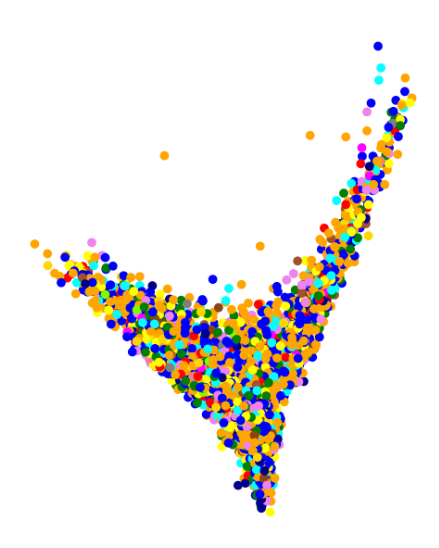

{: style="float: left; width:430px; margin-right: 1em;"}

During my studies (MSc), I walked the path between Theoretical Physics and Pure Mathematics.  I have recently transitioned to DS and AI.

Some of my programming, Data Science and AI projects can be found on [my github page](https://github.com/francisco-simoes).

In this website I store a selection of texts and notes, as well as links to some projects.
Many were written on Physics and Mathematics during my studies; others concern DS and AI topics.

Here you can also consult my CV.

## Highlights

---------------------

 
{: style="float: left; width:60px; margin-right: 1em;"}
[Jaccard Kernel PCA in genomic data for ALS](./assets/docs/jPCA_internship_summary.pdf)

Summary of important results from my internship at the UMC Utrecht Brain Center.
 

---------------------

 
{: style="float: left; width:60px; margin-right: 1em;"}
[Monoidal Category of D-branes in a Kazama-Suzuki  model](/assets/docs/Thesis_Francisco_Simoes.pdf)

My Master's thesis. It consists of an application of category theory to string theory.
 

---------------------
