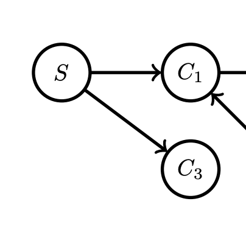
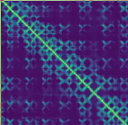
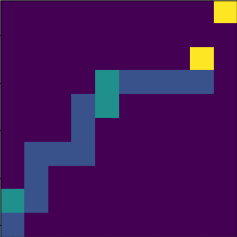
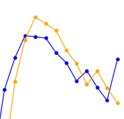
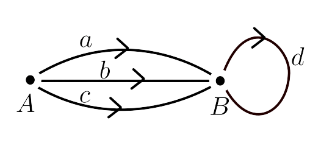
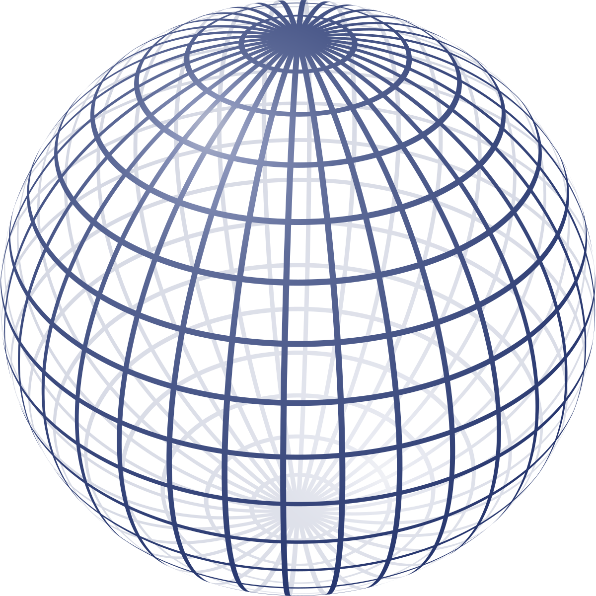
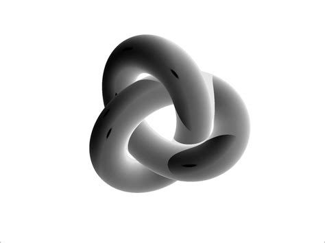
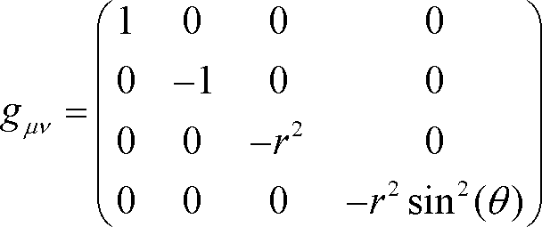

---------------------

 
{: style="float: left; width:120px; margin-right: 1em;"}
[Paper summaries for the causal inference reading group](./assets/docs/reading_group_notes.pdf)

These are summaries of some of the papers that are analysed in the reading group of the causal inference lab from the University of Amsterdam's Institute of Logic, Language and Computation, which I joined in May 2021.
I will update this file every couple of weeks.

 

---------------------

 
{: style="float: left; width:120px; margin-right: 1em;"}
[Photoscale data api package - public version (GitHub)](https://github.com/francisco-simoes/photoscale-data-api-public)

This is a description of a Python package I was responsible for developing. 
I worked on it with my team at my current company.
The package consists of an api that enables the easy analysis access to different types of data (pictures, segmentation polygons, weight curves,... ) used to tackle the computer vision problem that the company's product solves.
For reasons of industry competition I did not add the code itself to the repository.
So this repository was made public for portfolio reasons, or to be used by someone seeking inspiration to solve a similar problem.

 

---------------------

 
{: style="float: left; width:120px; margin-right: 1em;"}
[Jaccard Kernel PCA in genomic data for ALS](./assets/docs/jPCA_internship_summary.pdf)

This is a summary of important results obtained during my four-and-a-half months long internship at the UMC Utrecht Brain Center.
I developed a set of scripts capable of running Jaccard PCA on very large datasets (through parallelization) and another one allowing for arbitrary positive integers in the burdens (the scripts can be found in [the github repository](https://github.com/francisco-simoes/genotype-hpc-jPCA)).
 

---------------------

 
{: style="float: left; width:120px; margin-right: 1em;"}
[The AlphaFold algorithm](./assets/docs/alphafold_summary.pdf)

Informal summary of the AlphaFold pipeline, and of the main concepts one needs in order to understand it.
This comes from the initial project of my internship at the UMC Utrecht Brain Center, which was eventually abandoned when we realized that the opensourced part of AlphaFold is not enough from practical usage.
The reason why is also discussed in this summary.
 

---------------------

 
{: style="float: left; width:120px; margin-right: 1em;"}
[Pathfinding in a grid using the genetic algorithm (GitHub)](https://github.com/francisco-simoes/genetically-trained-robots)

A short project where I implemented the genetic algorithm from scratch in a population of virtual "robots" to solve a 2D pathfinding problem in a grid.
The goal was to visualize and understand the genetic algorithm.
The "DNA" of a robot is a sequence of instructions to move from the set {"up", "down", "left", "right"}. 
After enough generations, the robots are able to find the goal position (upper-right corner of a 10x10 grid) from the initial position (lower-left corner of the grid).
 

---------------------

 
{: style="float: left; width:120px; margin-right: 1em;"}
[Forecast of mosquitoe population (blog article)](https://www.510.global/healthcare-hackathon-results/)

Summary of a group project for the red cross, developed in a weekend-long healthcare hackaton.
We created a time series model to predict peaks in the mosquitoe population in the Philippines.
From this, one can in principle try to predict Dengue outbreaks.
My part was to establish a base model using simple exponential smoothing methods, about which I knew nothing about prior to this project.
Besides the article, an exploration of exponential smoothing methods (using the mosquitoe data) can be found in the [github repository](https://github.com/francisco-simoes/exponential_smoothing-mosquitoes_hackaton).
 

---------------------

 
{: style="float: left; width:120px; margin-right: 1em;"}
[Monoidal Category of D-branes in a Kazama-Suzuki  model](/assets/docs/Thesis_Francisco_Simoes.pdf)

This is my Master's thesis. It consists of an application of category theory to string theory. I included a brief introduction to both category theory and superstring theory. I believe it can be useful to someone trying to understand  Kac-Moody algebras in the context of string theory, and representation theory of the Virasoro algebra in general.  
 

---------------------

 
{: style="float: left; width:120px; margin-right: 1em;"}
[Category of cobordisms, 2TQFTs and Frobenius algebras](/assets/docs/2TQFT_Frob.pdf)  

This is a summary of some contents of the book by Joachim Kock on TQFTs. It is the result of a month of self-study. These notes can be used alongside the book, but not by themselves. I hope they can be useful for a physicists trying to get a quick look into TQFTs from the categorical point of view.
 

---------------------

 
{: style="float: left; width:159px; margin-right: 1em;"}
[Highway to modular categories](./assets/docs/ModularCats.pdf)  

I summarized the quickest way I could find of going from monoidal categories all the way to modular categories. Up to pre-modular categories the treatment is quite complete, but after that the discussion gets more superficial as I was running out of time.
I believe this is a good document to read if you are a mathematical physicists trying to get to modular categories as quickly as possible. Read alongside "Tensor categories" by Etingof et al.
 

---------------------

 
{: style="float: left; width:169px; margin-right: 1em;"}
[Cell complex structure of the double tetrahedron](./assets/docs/tetrahedron_cell_structure.pdf)  

I construct the cell structure of the double tetrahedron, and use it to find its fundamental group. 
I solved this problem in the context of a course on algebraic geometry.
 

---------------------

 
{: style="float: left; width:110px; margin-right: 1em;"}
[The de Rham cohomology of the n-sphere](./assets/docs/CohomologyForSpheres.pdf)

Explicit demonstration of the de Rham cohomology of the n-sphere, assuming that the easiest case
of the 1-sphere - which can be seen in most differential geometry books - is already solved.
 

---------------------

 
{: style="float: left; width:149px; margin-right: 1em;"}
[Topological and metric spaces](./assets/docs/AQuickTakeOnMetricAndTopology.pdf)  

This is a very quick take on metric and topological spaces. It is just enough to prepare a physicist to learn about manifolds for a General Relativity course.

 

---------------------

 
{: style="float: left; width:149px; margin-right: 1em;"}
[Tensors](./assets/docs/TensorsQuickTake.pdf)  

Physicists usually treat tensors as indexed lists transforming in a certain way.
Here I briefly present a basis-invariant way to look at tensors which seems to me much more natural.
I also comment on how bras in Quantum Mechanics are examples of tensors.
 

---------------------
