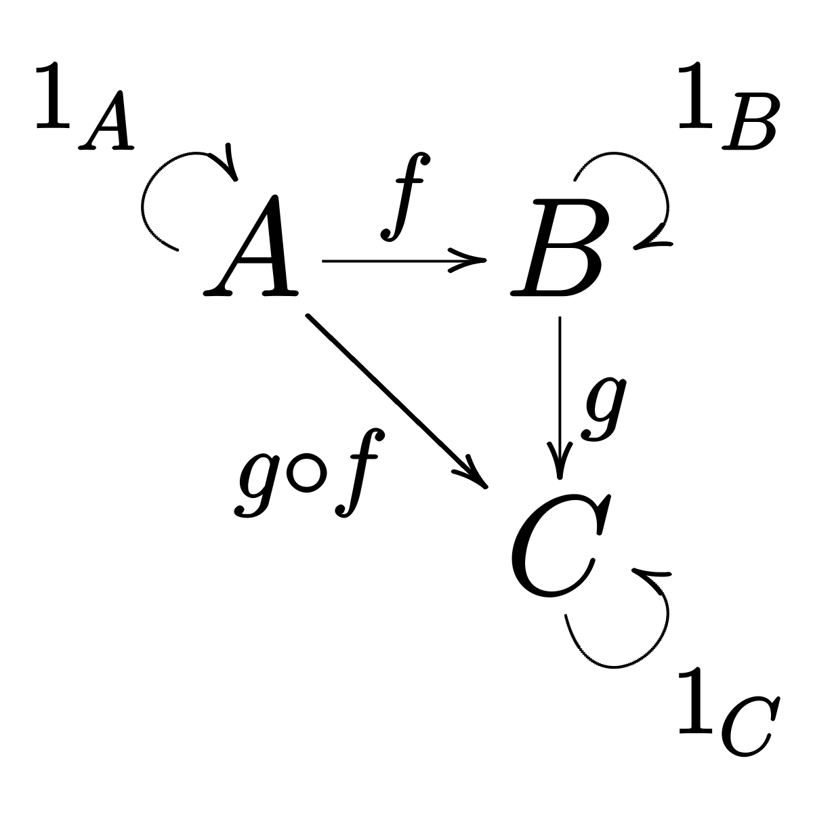

 
{: style="float: left; width:150px; margin-right: 1em;"}
[Jaccard Kernel PCA in genomic data for ALS](./assets/docs/jPCA_internship_summary.pdf)

This is a summary of important results obtained during my four-and-a-half months long internship at the UMC Utrecht Brain Center under the guidance of Dr. Kevin P. Kenna. 
The goal of the project was to aid an ongoing GWAS on Amyotrophic lateral sclerosis (ALS) by improving on its population stratification control method. 
A good candidate method is Jaccard principal component analysis (jPCA) - a particular case of Kernel principal component analysis.
I developed a set of scripts capable of running jPCA on very large datasets (through parallelization) and another one allowing for arbitrary positive integers in the burdens.\\
The scripts can be found in [the github repository](https://github.com/francisco-simoes/genotype-hpc-jPCA).
 

---------------------

 
{: style="float: left; width:150px; margin-right: 1em;"}
[Pathfinding in a grid using the genetic algorithm (GitHub)](https://github.com/francisco-simoes/genetically-trained-robots)
A short project where I implemented the genetic algorithm from scratch in a population of virtual "robots" to solve a 2D pathfinding problem in a grid.
 

---------------------

 
{: style="float: left; width:150px; margin-right: 1em;"}
[Monoidal Category of D-branes in a Kazama-Suzuki  model](/assets/docs/Thesis_Francisco_Simoes.pdf)

This is my Master's thesis. It consists of an application of category theory to string theory. I included a brief introduction to both category theory and superstring theory. I believe it can be useful to someone trying to understand  Kac-Moody algebras in the context of string theory, and representation theory of the Virasoro algebra in general.  
 

---------------------

 
{: style="float: left; width:150px; margin-right: 1em;"}
[Category of cobordisms, 2TQFTs and Frobenius algebras](/assets/docs/2TQFT_Frob.pdf)  

This is a summary of some contents of the book by Joachim Kock on TQFTs. It is the result of a month of self-study. These notes can be used alongside the book, but not by themselves. I hope they can be useful for a physicists trying to get a quick look into TQFTs from the categorical point of view.
 

---------------------

 
{: style="float: left; width:149px; margin-right: 1em;"}
[Highway to modular categories](./assets/docs/ModularCats.pdf)  

I summarized the quickest way I could find of going from monoidal categories all the way to modular categories. Up to pre-modular categories the treatment is quite complete, but after that the discussion gets more superficial as I was running out of time.
I believe this is a good document to read if you are a mathematical physicists trying to get to modular categories as quickly as possible. Read alongside "Tensor categories" by Etingof et al.
 

---------------------

 
{: style="float: left; width:169px; margin-right: 1em;"}
[Cell complex structure of the double tetrahedron](./assets/docs/tetrahedron_cell_structure.pdf)  

I construct the cell structure of the double tetrahedron, and use it to find its fundamental group. 
I solved this problem in the context of a course on algebraic geometry.
 

---------------------

 
{: style="float: left; width:149px; margin-right: 1em;"}
[Topological and metric spaces](./assets/docs/AQuickTakeOnMetricAndTopology.pdf)  

This is a very quick take on metric and topological spaces. It is just enough to prepare a physicist to learn about manifolds for a General Relativity course.
 

---------------------

 
{: style="float: left; width:149px; margin-right: 1em;"}
[Tensors](./assets/docs/TensorsQuickTake.pdf)  
Physicists usually treat tensors as indexed lists transforming in a certain way.
Here I briefly present a basis-invariant way to look at tensors which seems to me much more natural.
I also comment on how bras in Quantum Mechanics are examples of tensors.
 

---------------------
